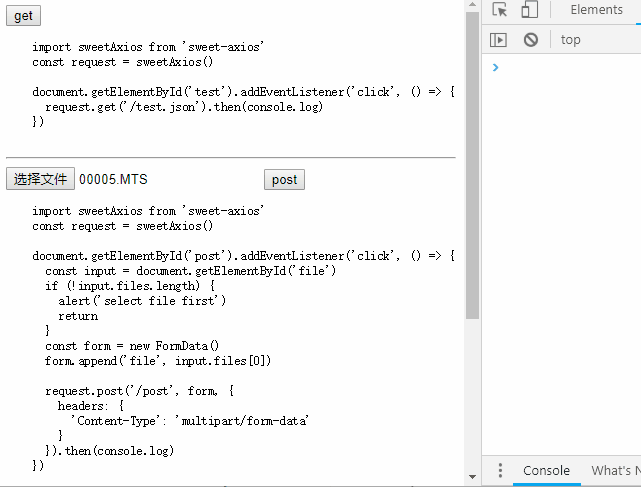

# sweet-axios

axios with sweet alert | 自动提示进度的axios 



## usage | 使用

```
npm i sweet-axios --save-dev
```

```
import sweetAxios from 'sweet-axios'
const request = sweetAxios()

document.getElementById('test').addEventListener('click', () => {
  request.get('/test.json').then(console.log)
})
```

## run example | 运行示例

```
git clone https://github.com/postor/sweet-axios.git
cd sweet-axios
npm i
npm run dev
```